# Universal dev Framework - Android | IOS | Web | TV
[](https://www.npmjs.com/package/your-library)
[](https://opensource.org/licenses/MIT)

A powerful mobile architecture framework for building scalable and maintainable React Native applications.

## Features

- **Scalable Structure:** Organize your codebase with a scalable folder structure, making it easy to manage large applications.

- **State Management:** Integrate a robust state management solution to handle application-wide data and state.

- **Navigation:** Implement a flexible and customizable navigation system for seamless user experiences.

- **Theming:** Easily customize the look and feel of your application with a theming system.

- **Network Requests:** Handle API calls efficiently and consistently across your application.

- **Authentication:** Implement authentication flows with ease using the built-in authentication modules.

- **Error Handling:** Centralized error handling for better debugging and user experience.

- **UI components:**  A collection of  reusable UI components for Expo React Native.

## Installation

```bash
git clone https://github.com/DeveloperRejaul/universal-dev.git
```
# Some UI Demo
<p>
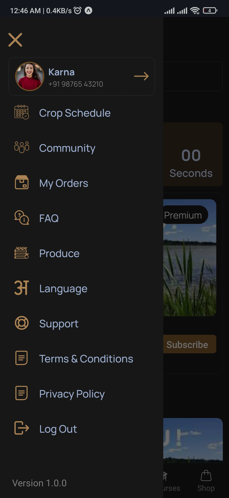

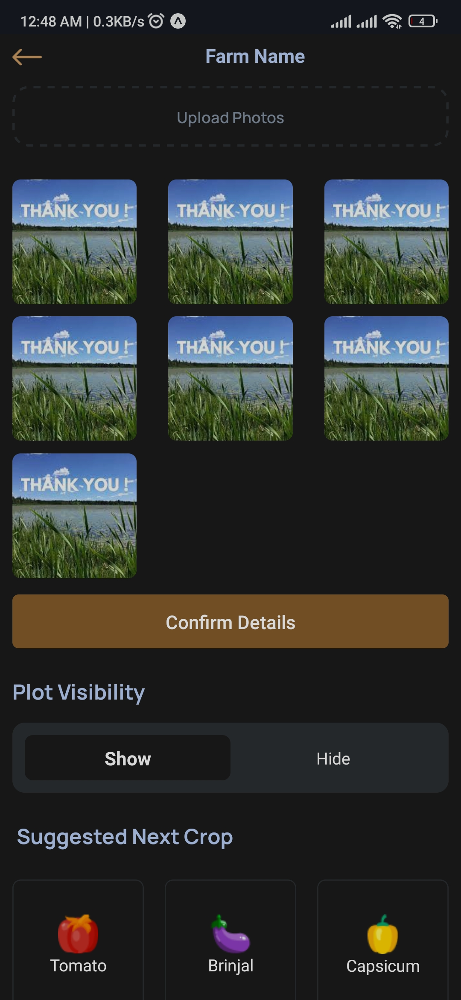
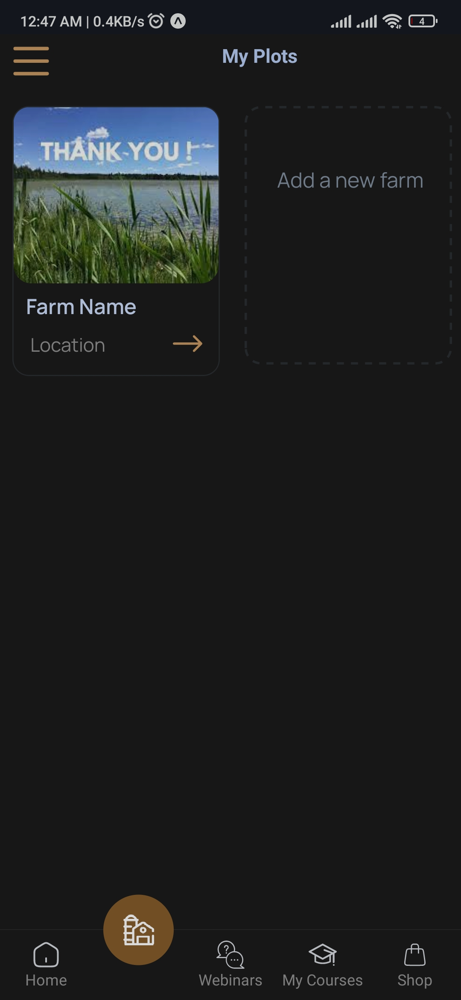
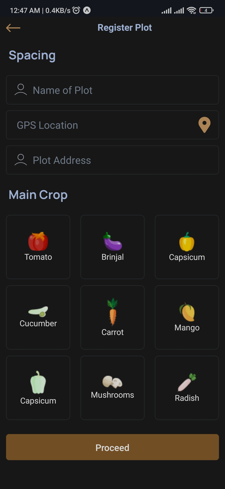
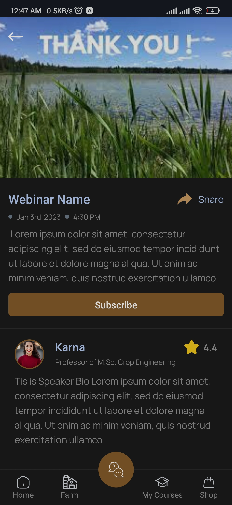
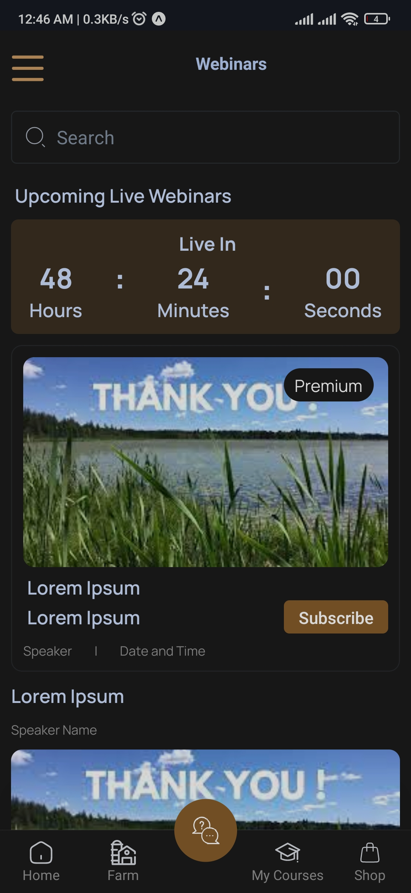
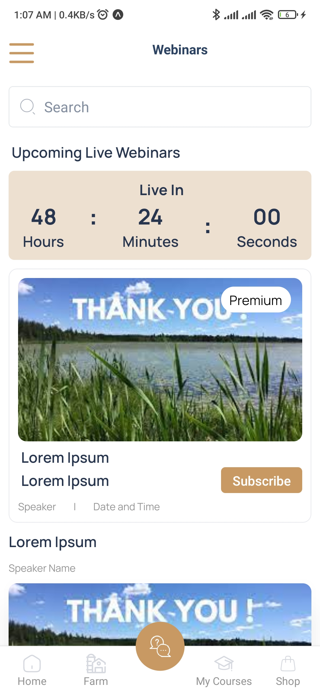

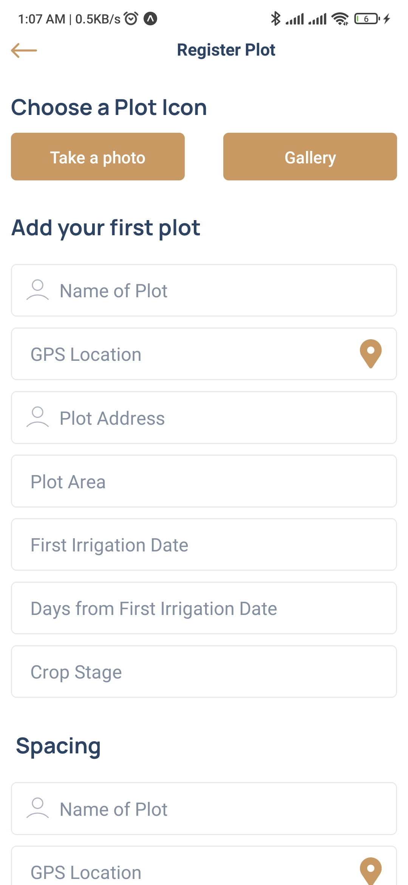
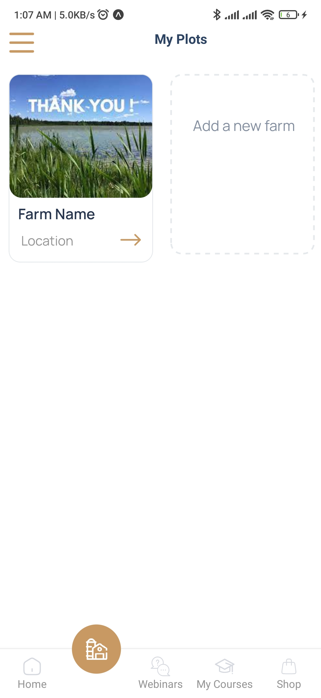
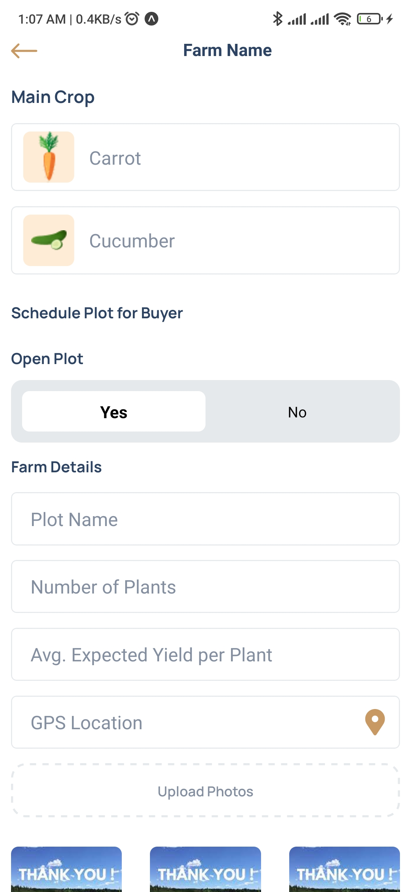

</p>

# web Demo
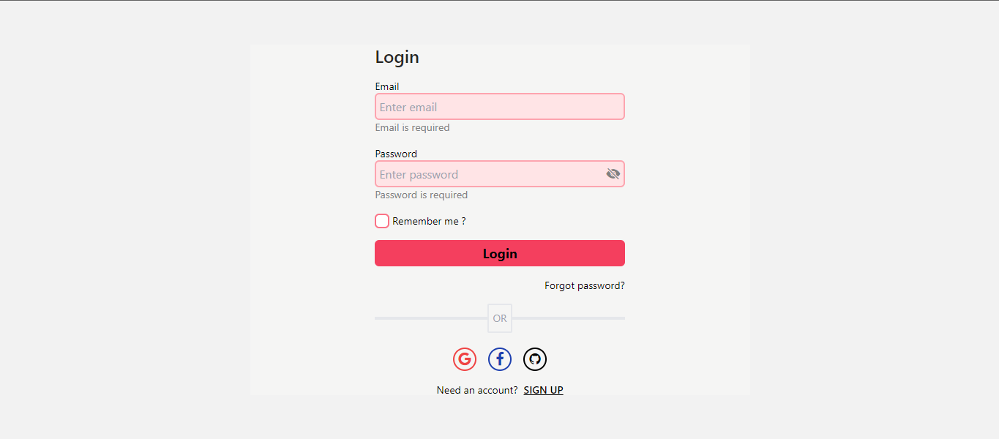